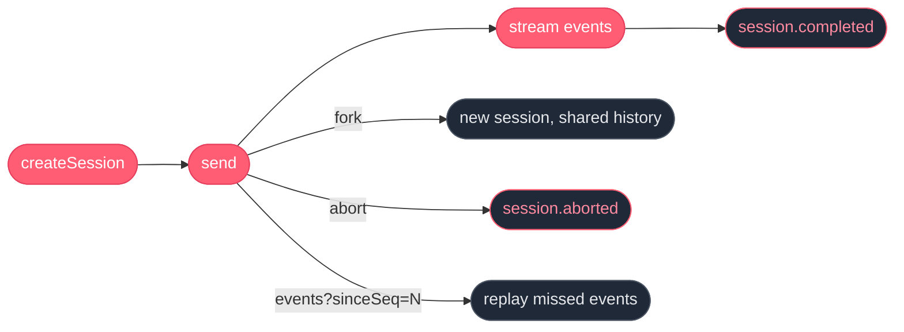

A **session** is one live conversation with an agent. Each session has its own memory and its own event stream.



## Create one

```ts
const session = await client.agent("hello-agent").createSession();
```

## Get a reply

```ts
const { value } = await session
  .send({ parts: [{ type: "text", text: "Say hi." }] })
  .result<string>();
```

`result()` resolves on the first terminal event.

## Stream the events

```ts
for await (const ev of session.stream({ parts: [{ type: "text", text: "Hi" }] })) {
  if (ev.type === "part.appended" && ev.part.type === "text") {
    process.stdout.write(ev.part.text);
  }
  if (ev.type === "session.completed") break;
}
```

## Multi-turn

A session keeps state between sends:

```ts
const session = await client.agent("multi-turn").createSession();
await session.send({ parts: [{ type: "text", text: "My name is Ada." }] }).result();
const { value } = await session.send({ parts: [{ type: "text", text: "What's my name?" }] }).result();
// → "Your name is Ada."
```

## Fork

Snapshot a session and continue both branches independently:

```ts
const forkRes = await fetch(`https://api.swarmlord.ai/session/${root.id}/fork`, {
  method: "POST",
  headers: { Authorization: `Bearer ${apiKey}` },
});
const { id } = await forkRes.json();
const forked = client.session(id);
```

## Resume

Reconnect to a session and replay missed events:

```ts
import { streamSession } from "swarmlord";

const stream = streamSession(session.id, {
  opts: { apiKey },
  sinceSeq: lastSeen,
});
```

Recent events are kept around for replay — any practical reconnect window is covered.

## Abort

```ts
await session.abort();
```

Cancels the in-flight model call and emits `session.aborted`.

## Terminal guarantee

Every session reaches a terminal event (`session.completed`, `session.completed_degraded`, or `session.aborted`). Consumers never hang.

See [Events](/api/events) for the full vocabulary.
